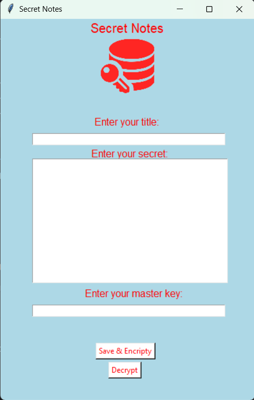
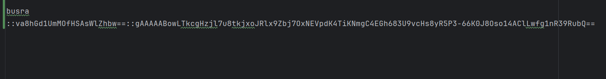
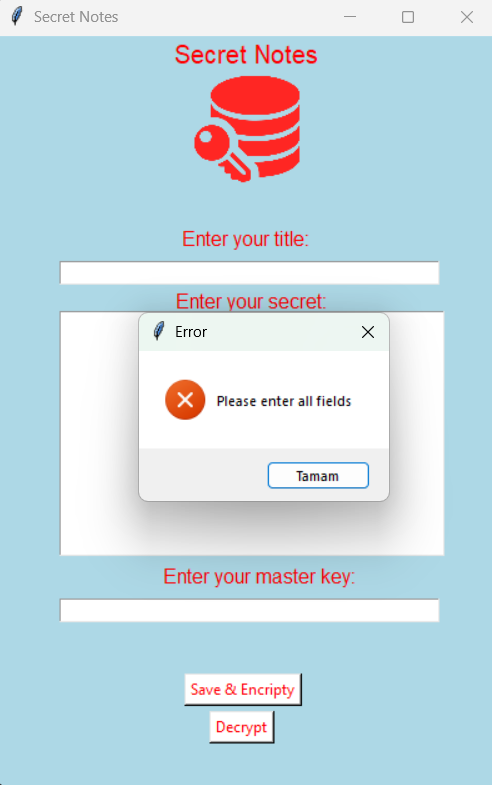

# YourSecretNotes (Tkinter + Fernet)

Parola tabanlı şifreleme ile çalışan basit bir **gizli not** uygulaması.  
Başlık–Not–Anahtar akışıyla **şifrele → kaydet** ve **çöz → görüntüle**.

## Ekran Görüntüleri
<p align="center">
  
  
  
</p>
## Özellikler
- **PBKDF2HMAC + Fernet** ile güvenli şifreleme
- Kayıt formatı: `title::salt_b64::token` (her not tek satır)
- **Popup yok**, tek satırlık **durum çubuğu** (hatalar/başarılar burada)
- Minimal arayüz, tek dosya

## Kurulum
```bash
pip install cryptography
Çalıştırma
bash
Kodu kopyala
python main.py
Kullanım
Enter your title: Not için kısa bir başlık yaz.

Enter your secret: Not içeriğini yaz.

Enter your master key: Anahtar/parola gir (unutma!).

Save & Encripty: Notu şifreleyip mysecret.txt içine kaydeder.

Decrypt: Aynı başlık + anahtar ile notu geri çözüp ekrana getirir.

Notlar mysecret.txt dosyasında şu biçimde tutulur:

BASLIK::U2FsdEVXaW5JbkJhc2U2NA==::gAAAAABk...UzunSifreliMetin...==
